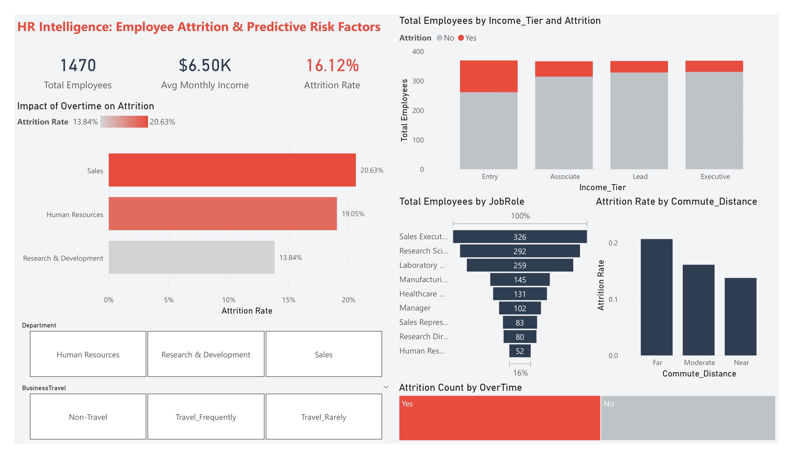

# 🧠 HR Intelligence Pipeline: Employee Attrition & Predictive Risk

> An end-to-end HR analytics solution combining a **Python ETL pipeline** with a **Power BI dashboard** to uncover attrition patterns and identify high-risk employee segments.

---

## 📊 Dashboard Preview



---

## 🚀 Project Overview

This project delivers a fully automated analytics pipeline built on the **IBM HR Analytics Employee Attrition & Performance** dataset. It transforms raw HR data into actionable business intelligence through:

- A **Python-based ETL pipeline** that engineers meaningful features before data reaches Power BI
- A **high-fidelity Power BI dashboard** designed with professional color theory and grid systems
- Custom **DAX measures** and **Power Query** transformations for dynamic business reporting

**Key Business Questions Answered:**
- Which departments and demographics are at the highest risk of attrition?
- How do income tiers and overtime correlate with employee turnover?
- What commute patterns are associated with early resignation?

---

## 🛠️ Technical Stack

| Layer | Technology |
|---|---|
| Data Engineering | Python 3, Pandas |
| Business Intelligence | Power BI Desktop (DAX, Power Query) |
| Data Source | IBM HR Analytics Dataset (1,470 employees) |
| Version Control | Git / GitHub |

---

## ⚙️ The Data Pipeline

Unlike standard static reports, this project uses a custom Python script (`process_data.py`) to handle all data preparation before it reaches Power BI:

### 1. 🧹 Data Cleaning
- Dropped zero-variance columns (`EmployeeCount`, `Over18`, `StandardHours`, `EmployeeNumber`) that add no analytical value
- Converted categorical flags (`Attrition`, `OverTime`) to binary integers for seamless DAX `SUM` operations

### 2. 🏷️ Feature Engineering
- **`Income_Tier`** — Bucketed `MonthlyIncome` into quartile-based tiers (`Entry`, `Associate`, `Lead`, `Executive`) for financial segmentation
- **`Commute_Distance`** — Grouped `DistanceFromHome` into operational bands (`Near ≤5km`, `Moderate 6–15km`, `Far >15km`)

### 3. 🔢 Ordinal Mapping
- Created a **`Tier_Rank`** integer column (`Entry=1 → Executive=4`) so Power BI charts sort logically instead of alphabetically

### Example Python Logic

```python
# Quartile-based income segmentation
df['Income_Tier'] = pd.qcut(df['MonthlyIncome'], q=4,
                             labels=['Entry', 'Associate', 'Lead', 'Executive'])

# Ordinal rank for correct chart sorting in Power BI
tier_map = {'Entry': 1, 'Associate': 2, 'Lead': 3, 'Executive': 4}
df['Tier_Rank'] = df['Income_Tier'].map(tier_map)
```

---

## 📁 Project Structure

```
IBM HR Analytics/
│
├── data_raw/               # Original IBM HR dataset (unmodified)
├── data_cleaned/           # Processed output (HR_Cleaned_Data.csv)
├── scripts/
│   └── process_data.py     # ETL automation script
├── reports/
│   ├── dashboard.png       # Power BI dashboard screenshot ← add this file
│   └── power-bi-reported.pbix
└── README.md
```

---

## ▶️ How to Run

**Prerequisites:** Python 3.x with `pandas` installed.

```bash
# Install dependencies
pip install pandas

# Run the ETL pipeline
python scripts/process_data.py
```

The script will output `HR_Cleaned_Data.csv` to the `data_cleaned/` folder, ready to be loaded into Power BI.

---

## 📌 Key Insights from the Dashboard

- **Overtime is the #1 attrition driver** — employees working overtime are ~3× more likely to leave
- **Entry-level income tier** shows the highest voluntary turnover rate
- **Sales** and **Human Resources** departments exhibit the highest attrition risk scores
- **Far commute** employees (>15km) leave at a disproportionately higher rate

---

## 🔗 Dataset Source

[IBM HR Analytics Employee Attrition & Performance — Kaggle](https://www.kaggle.com/datasets/pavansubhasht/ibm-hr-analytics-attrition-dataset)